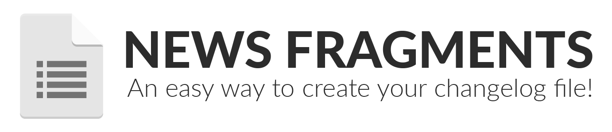

<p align="center">
   
</p>

[](https://sonarqube.com/dashboard/index/54b291df-ce9e-4a5f-b1dd-36cb380195ec) [](https://sonarqube.com/dashboard/index/54b291df-ce9e-4a5f-b1dd-36cb380195ec) [](https://sonarqube.com/dashboard/index/54b291df-ce9e-4a5f-b1dd-36cb380195ec) [](https://sonarqube.com/dashboard/index/54b291df-ce9e-4a5f-b1dd-36cb380195ec) [](https://sonarqube.com/dashboard/index/54b291df-ce9e-4a5f-b1dd-36cb380195ec)

News fragments is a plugin for [release-it](https://github.com/release-it/release-it) that helps you to generate a changelog file.

Basically, you need to specify a folder to be your center of fragments that will generate a custom changelog when released. After that, you'll create files with the desired extension with quick messages inside that folder to better understand what will come up on the new version of your software.

## Setup

In [release-it](https://github.com/release-it/release-it) config at `package.json`, create a `news-fragments` key-pair to override the default config - e.g.

```json
"plugins": {
  "news-fragments": {}
}
```

## Config

### Default config

```json
{
  "startString": null,
  "changelogFile": "CHANGELOG.md",
  "changelogDateFormat": "YYYY-MM-DD",
  "changelogTemplate": changelogTemplate,
  "fragmentsFolder": "fragments",
  "fragmentsTypes": [
    { "title": "Features", "extension": "feature" },
    { "title": "Bugfixes", "extension": "bugfix" },
    { "title": "Documentation", "extension": "doc" },
    { "title": "Deprecations and Removals", "extension": "removal" },
    { "title": "Misc", "extension": "misc" }
  ],
}
```

### Default changelog template

```
# [{{newVersion}}] - ({{bumpDate}})
{{#fragments}}
## {{title}}
{{#each fragmentEntries}}
* {{this}}
{{/each}}
{{/fragments}}
```

### Config params

- **changelogFile**: A path to the file that will center your changelog.
- **changelogDateFormat**: The date format that will be send to changelog template.
- **changelogTemplate**: A [handlebars](https://www.npmjs.com/package/handlebars) template that will be used to render your changelog file content.
- **fragmentsFolder**: A path to the folder that the fragments should be stored.
- **fragmentsTypes**: An array containing a collection of objects with the title of changelog section and the extension of fragment types.

> See this plugin in action by checking our [CHANGELOG.md](./CHANGELOG.md)

## CLI

```bash
news-fragments --help
```
